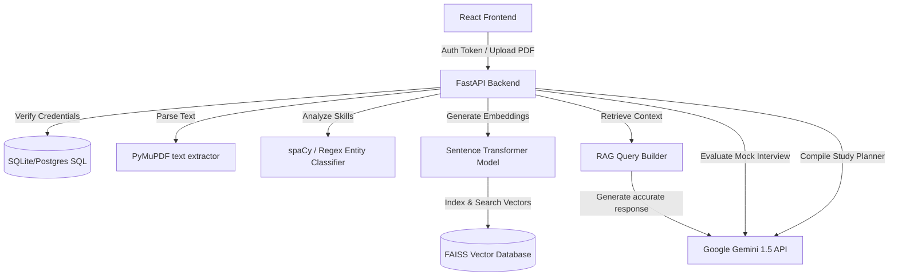

# AI Campus Placement Strategist

AI Campus Placement Strategist is a full-stack SaaS platform designed to help engineering students assess their readiness, audit resumes, learn target skills, organize structured preparation planners, and run conversational mock interviews evaluated by AI. It uses FastAPI for the backend, PostgreSQL/SQLite for structured data, Sentence Transformers & FAISS for vector search indexes (RAG), and React + Vite + Tailwind CSS for a premium dark-mode dashboard interface.

---

## 🛠️ Technology Stack

### Frontend
- **React (Latest)** & **Vite**
- **Tailwind CSS** (Custom dark glassmorphic aesthetics)
- **React Router** (Auth route protection guards)
- **Axios** (API communication)
- **Recharts** (Performance analytics graphs)
- **Lucide Icons** (Visual indicators)

### Backend
- **FastAPI** (Python 3.12+)
- **SQLAlchemy** (Object Relational Mapping)
- **PyJWT** & **Passlib (bcrypt)** (Secure auth tokens)
- **PyMuPDF (fitz)** (PDF Resume text reading)
- **spaCy** & **Regex Fallback** (Technical entity parsing)
- **FAISS** & **Sentence Transformers (`all-MiniLM-L6-v2`)** (Context indexing & retrieval)
- **Google Gemini 1.5 Flash API** (Structured resume feedback, study coach roadmap, mock interview grading)

---

## 🏗️ Architecture Design



---

## 🗄️ Database Schemas

### 1. `User`
- `id` (PK, Integer)
- `email` (Unique, String)
- `password_hash` (String)
- `is_admin` (Boolean, default False)
- `created_at` (DateTime)

### 2. `StudentProfile`
- `id` (PK, Integer)
- `user_id` (FK -> User, Unique)
- `name` (String)
- `college` (String)
- `branch` (String)
- `grad_year` (Integer)
- `cgpa` (Float)
- `skills` (Text, comma-separated list)
- `programming_languages` (Text, comma-separated list)
- `projects` (Text, JSON array details)
- `certifications` (Text, JSON array details)
- `target_role` (String)
- `target_companies` (Text, comma-separated list)
- `study_hours` (Integer)
- `preferred_lang` (String)

### 3. `Resume`
- `id` (PK, Integer)
- `user_id` (FK -> User)
- `filename` (String)
- `extracted_text` (Text)
- `resume_score` (Integer)
- `ats_score` (Integer)
- `strengths` (Text, JSON list)
- `weaknesses` (Text, JSON list)
- `suggestions` (Text, JSON list)
- `uploaded_at` (DateTime)

### 4. `Company`
- `id` (PK, Integer)
- `name` (Unique, String)
- `min_cgpa` (Float)
- `required_skills` (Text, comma-separated)
- `eligibility` (Text)
- `pattern` (Text)
- `rounds` (Text, JSON list)
- `package` (String)
- `preparation_tips` (Text)
- `faqs` (Text, JSON array)

### 5. `StudyPlan`
- `id` (PK, Integer)
- `user_id` (FK -> User)
- `target_role` (String)
- `target_company` (String)
- `plan_json` (Text, JSON study plan details)
- `created_at` (DateTime)

### 6. `MockInterviewSession`
- `id` (PK, Integer)
- `user_id` (FK -> User)
- `role` (String)
- `type` (String, e.g., HR, Technical)
- `company` (String)
- `score` (Integer, out of 100)
- `feedback` (Text)
- `transcript_json` (Text, JSON array)
- `created_at` (DateTime)

### 7. `ProgressLog`
- `id` (PK, Integer)
- `user_id` (FK -> User)
- `date` (Date)
- `study_hours` (Float)
- `completed_topics` (Text, comma-separated)
- `dsa_progress` (Integer)
- `sql_progress` (Integer)
- `ai_progress` (Integer)

---

## 🚀 Setup & Installation

### Backend Setup
1. Open a terminal and navigate to the backend folder:
   ```bash
   cd backend
   ```
2. Create and activate virtual environment:
   ```bash
   python -m venv .venv
   .venv\Scripts\activate
   ```
3. Install dependencies:
   ```bash
   pip install -r requirements.txt
   ```
4. Setup environment variables (`.env`):
   ```env
   GEMINI_API_KEY=your-google-gemini-api-key
   JWT_SECRET=secure-development-secret-1234
   DATABASE_URL=sqlite:///./placement_strategist.db
   ```
5. Launch development server:
   ```bash
   uvicorn main:app --reload --port 8000
   ```
   *Note: On first boot, the system auto-seeds 13 company records (Google, Microsoft, NVIDIA, TCS, etc.) and establishes vector indices.*

### Frontend Setup
1. Open a new terminal and navigate to the frontend folder:
   ```bash
   cd frontend
   ```
2. Install dependencies:
   ```bash
   npm install
   ```
3. Start development server:
   ```bash
   npm run dev
   ```
4. Access dashboard in browser: `http://localhost:5173`

---

## 📑 Core REST API Endpoints

### Auth
- `POST /api/auth/register`: Create user logins
- `POST /api/auth/login`: Authenticate and fetch bearer token
- `GET /api/auth/me`: Get current token details

### Profile
- `GET /api/profile`: Retrieve student profile
- `POST /api/profile`: Create/modify profile data

### Resume
- `POST /api/resume/upload`: Upload PDF resume, extract tech tokens, evaluate ATS score
- `GET /api/resume/analysis`: Retrieve latest ATS suggestions report

### Companies & Matching
- `GET /api/companies`: List all company criteria
- `GET /api/companies/recommendations`: Match student profile against requirements to categorize eligibility
- `GET /api/companies/{id}/skill-gap`: Fetch prioritize missing skills, course tracks, and project recommendations

### Study Planner
- `POST /api/planner/generate`: Query Gemini to compile customized study roadmap schedules
- `GET /api/planner/latest`: Retrieve active roadmap
- `POST /api/planner/progress`: Log hours and topic completion
- `GET /api/planner/progress`: Retrieve timeline logs (for dashboard analytics)

### Mock Interview
- `POST /api/interview/start`: Create interview session and receive first query
- `POST /api/interview/{session_id}/answer`: Evaluate typed response and fetch next question
- `GET /api/interview/past`: List past mock score records
- `GET /api/interview/{session_id}`: Get transcripts of complete session

### RAG Assistant
- `POST /api/chat/ask`: Search FAISS index and invoke Gemini to retrieve context-rich responses

### Admin Controls
- `GET /api/admin/students`: Roster student listings
- `GET /api/admin/analytics`: Platform-wide stats details
- `POST /api/admin/companies`: Create company records
- `PUT /api/admin/companies/{id}`: Update company records
- `DELETE /api/admin/companies/{id}`: Remove company listings
- `POST /api/admin/seed`: Re-populate database and FAISS index

---

## 🔮 Future Enhancements
- **Voice Mock Interviews**: Integrate Whisper API or browser webkitSpeechRecognition to support vocal mock interviews.
- **Auto-Sync to GitHub**: Automatically export suggested projects directly to candidate GitHub accounts.
- **Live Coding Assess**: Provide embedded IDE panels to test DSA compiling results.
